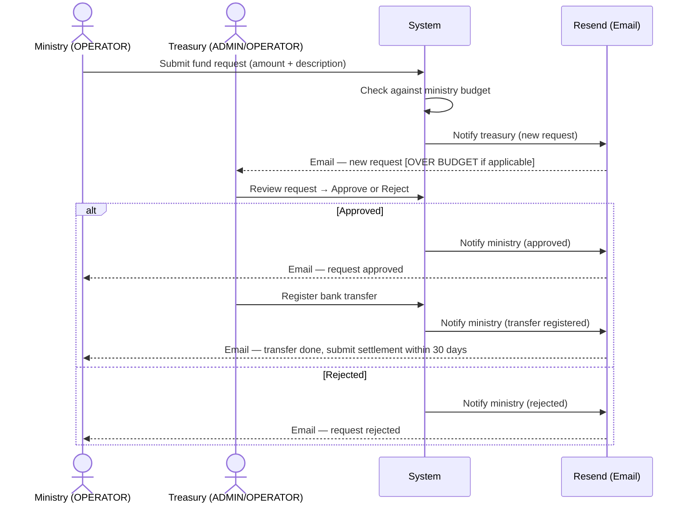
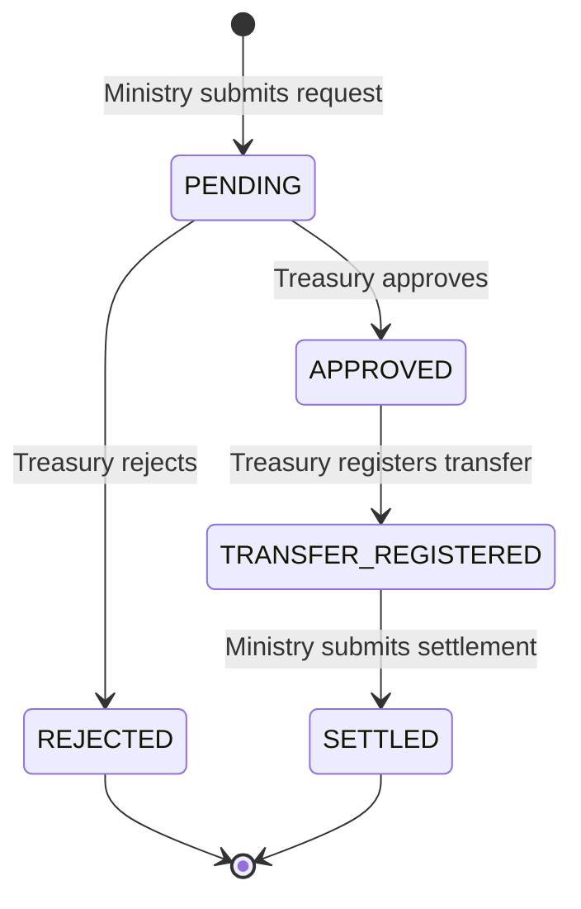
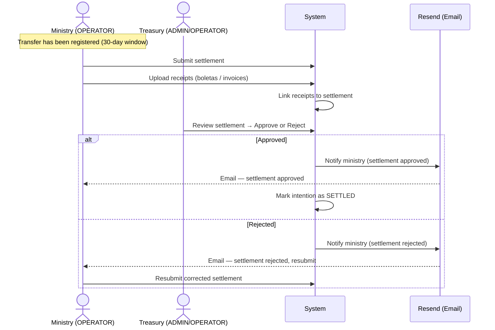
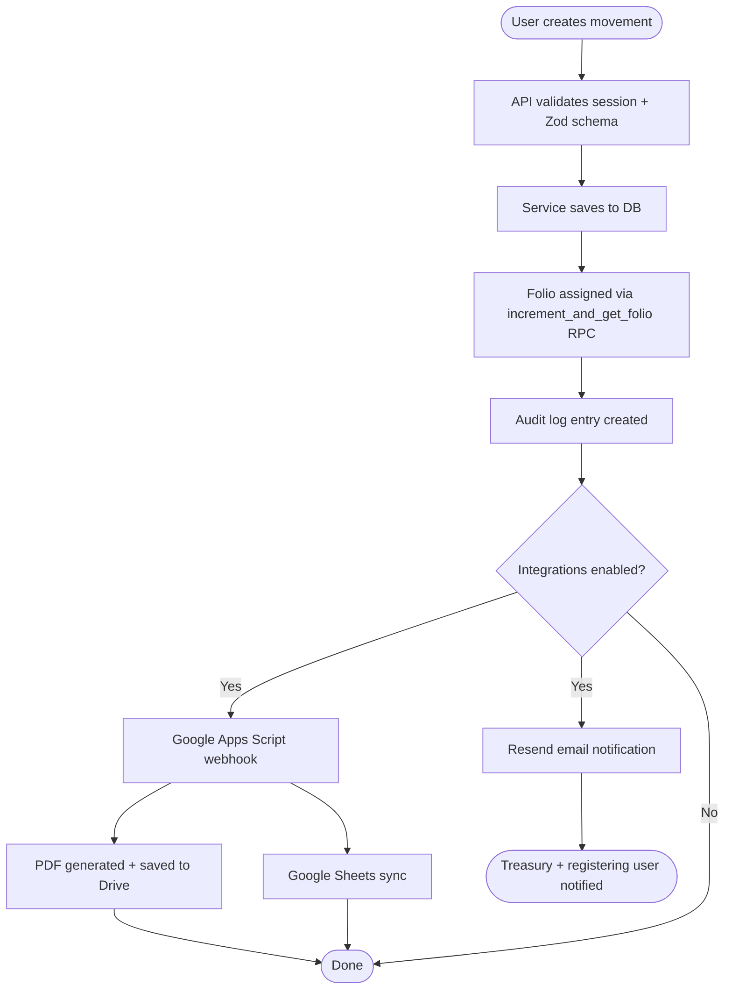
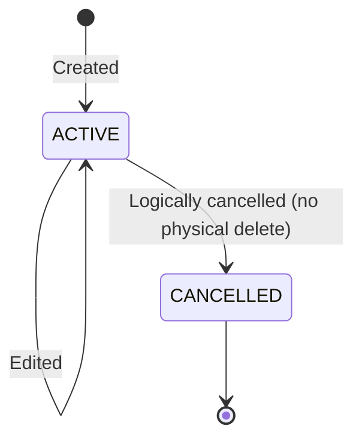
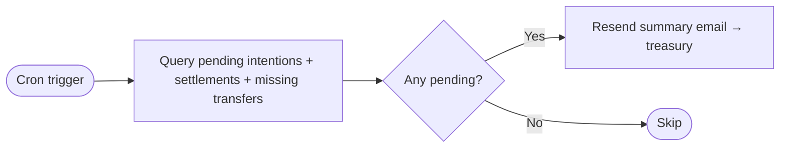

# Business Flow Diagrams

## Fund Request Flow (Solicitud de Fondos)

A ministry submits a fund request (intention). Treasury reviews it, registers the transfer,
and the ministry must later submit a settlement with receipts.

### States

---

## Settlement Flow (Rendición de Fondos)

After receiving a transfer, the ministry submits expense receipts for treasury review.

---

## Movement Registration Flow (Movimientos)

Standard income or expense recording with audit trail and optional integrations.

### Movement states

---

## Scheduled Reminders

A Supabase cron job (`supabase/migrations/20260426000002_reminder_cron.sql`) runs periodically
and sends a summary email to treasury when there are pending items.

